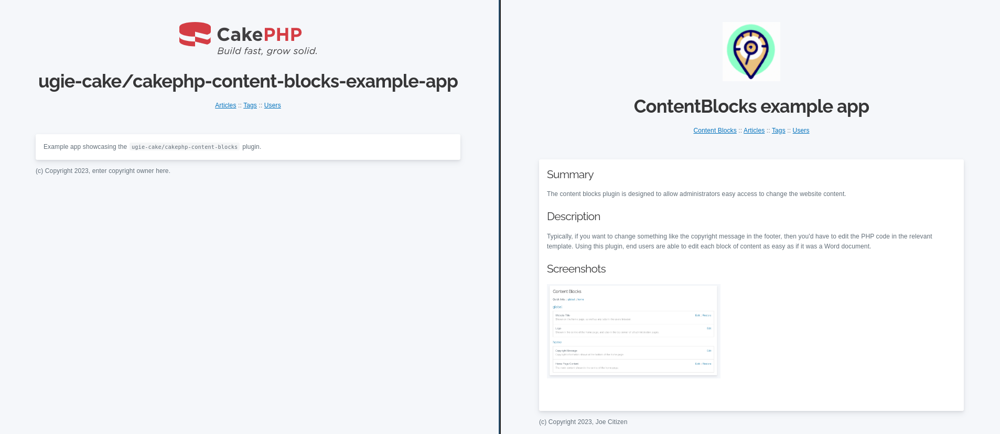

# ugie-cake/cakephp-content-blocks example

This repo showcases a CakePHP application that uses the <code>ugie-cake/cakephp-content-blocks</code> plugin
to make parts of the template user editable by administrators.

Documentation on how to use the plugin can be found at [ugie-cake/cakephp-content-blocks](https://github.com/ugie-cake/cakephp-content-blocks).

## Screenshots

### Before and after

The left shows a website before the administrator edited any of the content blocks.
The right shows after a new logo is uploaded, the website title is modified, the copyright footer is changed, and
rich text has been added to the body content.



## Running this example app

After setting up the `Datasource` in your `app_local.php` file, perform the following steps:

**Run migrations**

```
bin/cake migrations migrate --plugin=ContentBlocks
```
**Seed database with required content blocks**

```
bin/cake migrations seed --seed ContentBlocksSeed
```
